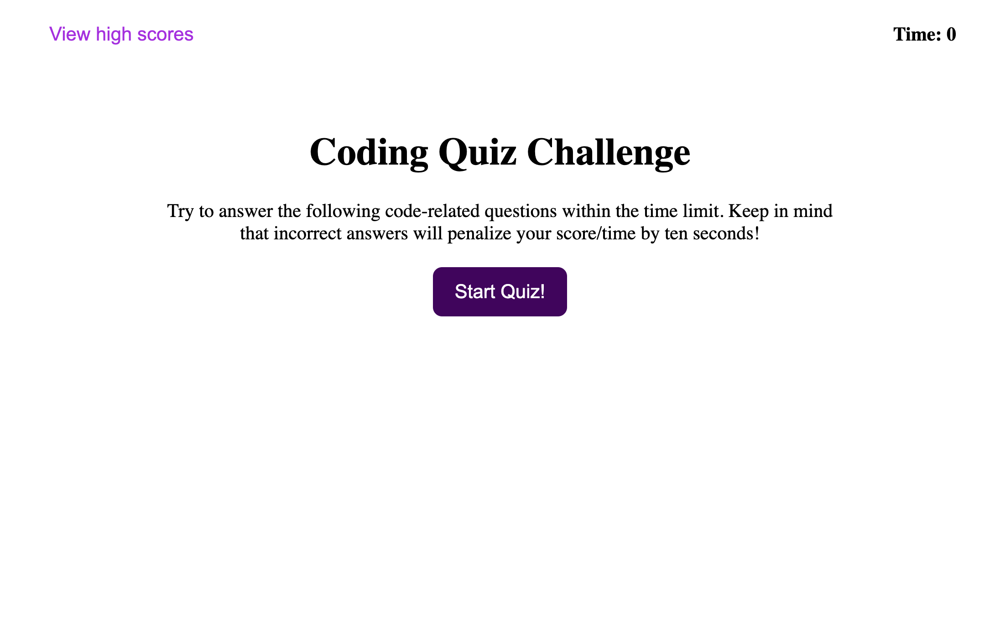
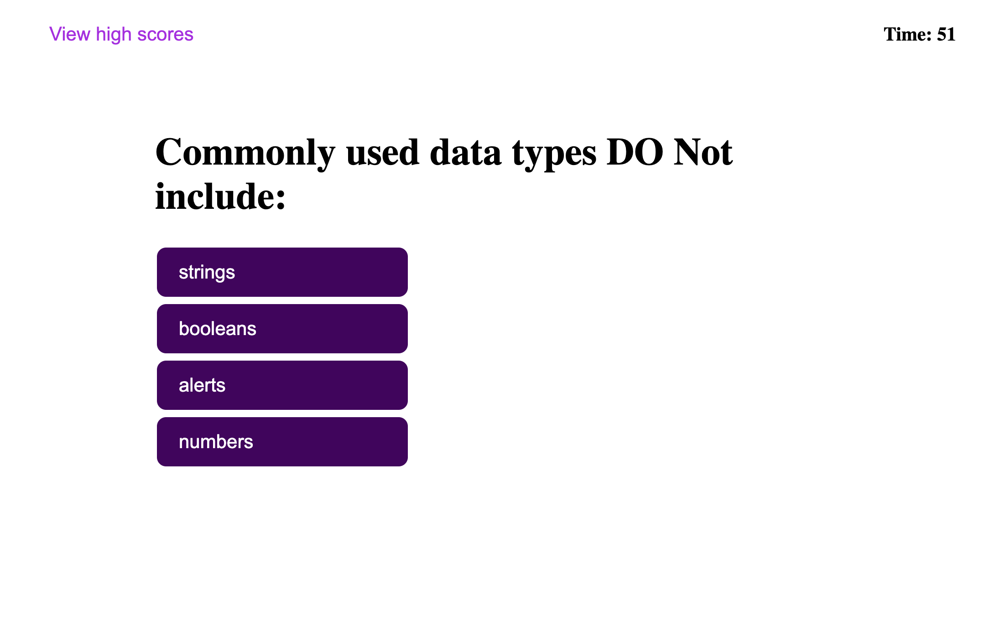
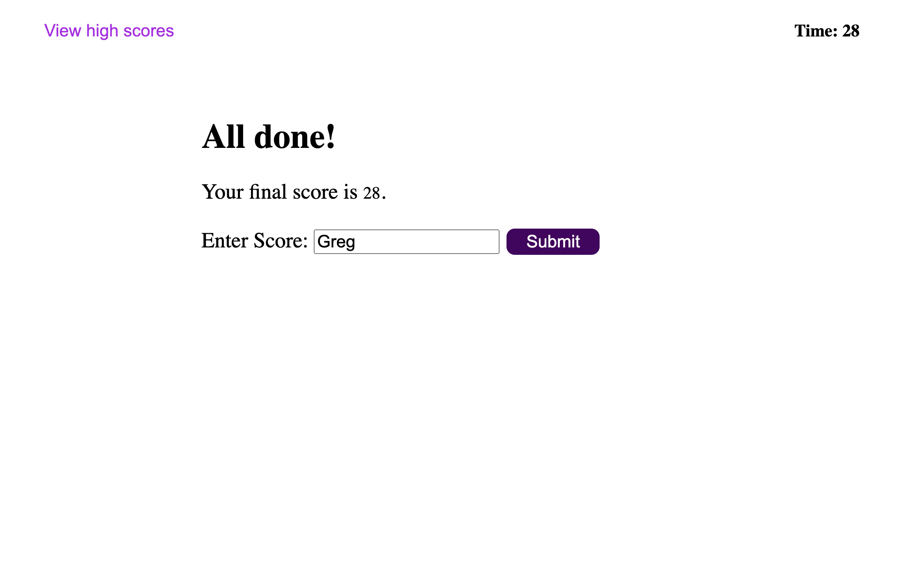
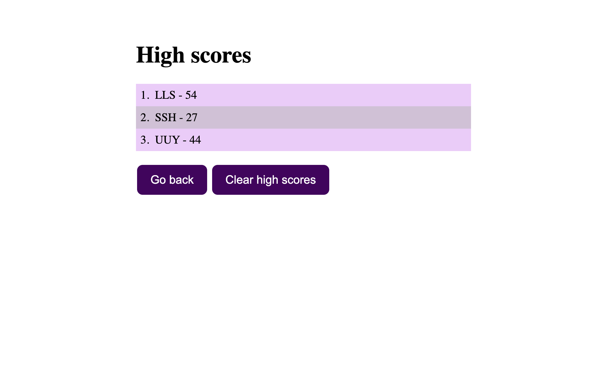

# Javascript Code Quiz
This is a repo to host a javascript code quiz application.
This application will quiz the user on Javascript questions, the quiz is timed, and the user can save their score when completed. 
Wrong answers will subtract from your total score(timer).

[https://lukegarnsey.github.io/code-quiz/](https://lukegarnsey.github.io/code-quiz/)

